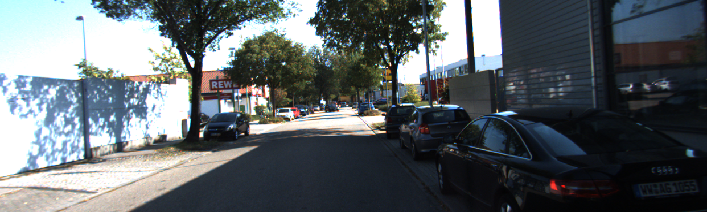

# SIFT Feature-Matching 

This is an implementation of SIFT algorithm to find correspondences in image pair. Generally, it is used to detect and describe local features in digital images, it locates certain keypoints and then furnishes them with quantitative information (descriptors) which can for example be used for object recognition.

## Images : 

<table><tr>
<td> 
  

    
  
 
</td>
<td> 
  

    
  
 
</td>
</tr></table>

[image1]: ./assets/Match.PNG
[image2]: ./assets/Inliers.PNG 
[image3]: ./assets/Outliers.PNG

## Feature Matching :

![alt text][image1]

### Inliers :

![alt text][image2]

### Outliers :

![alt text][image3]
